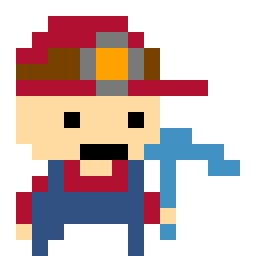

# MineWell 1.0-pre-alpha - net48 branch 

My .NET8->.NET 4.8 "quick port" of ITCH.io MineWell "Digger-like" open-sourced game project. :)

## Status
- Game framework ("engine"): MonoGame
- NET 4.8 used
- Project sucessfully builded 
- No touch panel support yet

## ToDo
- Add some cool music theme (search some Digger game collection)

## .
As is. No support. DIY. Learn purposes only.

## Reference(s)
- https://superpokeunicorn.itch.io/minewell Original project

## ..
[m][e] March 2025
